# Enterprise Active Directory SOC Lab

<p align="center">


</p>

---

## 📌 Project Overview

This project demonstrates the design, deployment, monitoring, and security validation of a small enterprise Active Directory environment. The lab simulates a real-world Windows domain consisting of a Domain Controller, Windows client, Linux attacker machine, and a centralized Wazuh SIEM platform used for security monitoring and threat hunting.

The objective was not only to build an Active Directory environment, but also to understand how common attack techniques generate telemetry, how those activities are detected by a SIEM, and how defenders can investigate them using MITRE ATT&CK mapping and threat hunting workflows.

Throughout the project, I deployed Active Directory services, configured enterprise users and security groups, integrated Windows logging with Wazuh and Sysmon, simulated multiple Active Directory attacks from Kali Linux, and investigated the resulting detections through Wazuh dashboards and event analysis.

Built an enterprise Active Directory lab integrated with Wazuh SIEM to simulate, detect, and investigate common Active Directory attack techniques using MITRE ATT&CK.

---

# 🎯 Objectives

- Build a functional Active Directory domain from scratch
- Configure enterprise users, groups, and service accounts
- Join Windows endpoints to the domain
- Integrate Windows event logs with Wazuh SIEM
- Deploy Sysmon for enhanced endpoint visibility
- Simulate common Active Directory attack techniques
- Detect attack activity using MITRE ATT&CK mapping
- Perform threat hunting using centralized telemetry
- Gain hands-on SOC analyst experience in monitoring and investigating enterprise environments

---

# 🏗️ Lab Architecture

The lab consists of a Windows Server 2022 Domain Controller, a domain-joined Windows 10 workstation, a Kali Linux attacker machine, and an Ubuntu server running Wazuh for centralized monitoring.

<p align="center">

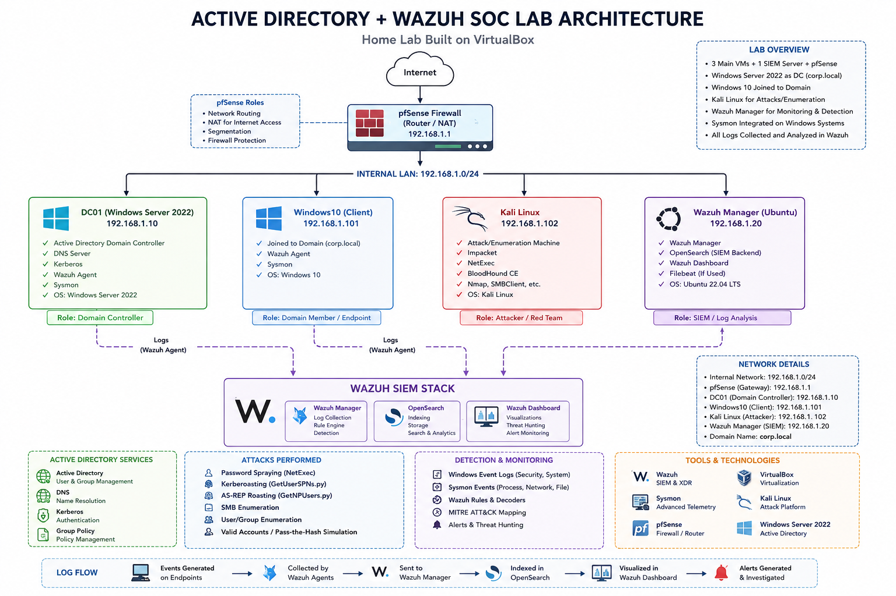

</p>

---

# 🖥️ Lab Environment

| Component | Purpose |
|-----------|----------|
| Windows Server 2022 | Active Directory Domain Controller |
| Windows 10 | Domain-joined enterprise workstation |
| Ubuntu Server | Wazuh SIEM Manager |
| Kali Linux | Attack simulation machine |
| Sysmon | Endpoint telemetry collection |
| Wazuh Agent | Log forwarding and monitoring |
| PowerShell | Active Directory automation |
| VirtualBox | Virtualization platform |

---

# 🛠️ Technologies Used

| Category | Technologies |
|-----------|--------------|
| Operating Systems | Windows Server 2022, Windows 10, Ubuntu Server, Kali Linux |
| Identity | Active Directory Domain Services |
| SIEM | Wazuh |
| Endpoint Monitoring | Sysmon |
| Logging | Windows Event Logs |
| Scripting | PowerShell |
| Offensive Tools | NetExec, Impacket |
| Detection Framework | MITRE ATT&CK |

---

# 📁 Repository Structure

```text
Enterprise-Active-Directory-SOC-Lab
│
├── README.md
│
├── images
│   ├── architecture
│   ├── ad-installation
│   ├── active-directory
│   ├── attacks
│   └── wazuh
│
└── scripts
```

---

# 📖 Project Workflow

This lab follows the same lifecycle a SOC analyst would encounter in an enterprise environment:

1. Build Active Directory
2. Configure enterprise users and groups
3. Deploy Windows endpoints
4. Configure centralized logging
5. Integrate Wazuh and Sysmon
6. Simulate Active Directory attacks
7. Detect malicious activity
8. Investigate alerts using Wazuh
9. Map detections to MITRE ATT&CK
10. Perform threat hunting

---

# ⚙️ Active Directory Deployment

The first phase of the project focused on building a functional Active Directory environment capable of supporting enterprise authentication, centralized identity management, and attack simulation.

The deployment included installing Active Directory Domain Services (AD DS), promoting the Windows Server to a Domain Controller, creating a new forest (`corp.local`), and joining a Windows 10 workstation to the domain.

---

## Windows 10 Joined to the Domain

The Windows 10 workstation was successfully joined to the `corp.local` domain, allowing centralized authentication and Group Policy management.

<p align="center">
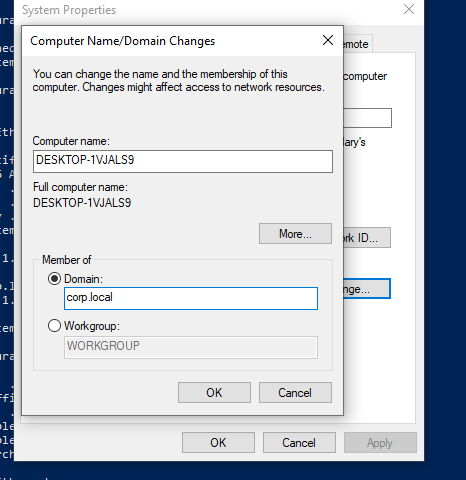
</p>

---

# 👥 Enterprise Configuration

To better simulate a real-world enterprise, multiple Organizational Units (OUs), users, security groups, and service accounts were created instead of relying on the default Active Directory objects.

This structure makes attack simulation and detection much more realistic while demonstrating common Active Directory administration tasks performed by system administrators.

---

## Security Groups

Role-based security groups were created to represent different departments and administrative teams within the organization.

Examples include:

- Finance_Users
- HR_Users
- IT_Users
- IT_Admins
- Sales_Users
- Server_Admins
- Workstation_Admins

<p align="center">
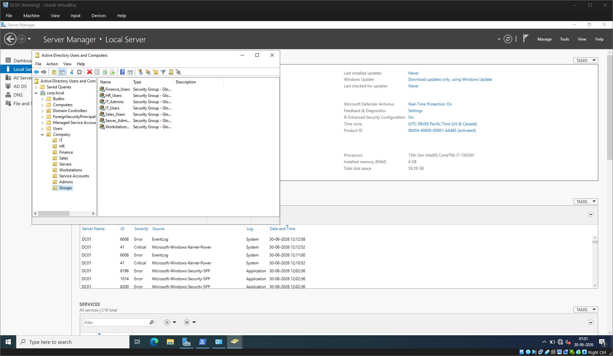
</p>

---

## User Account Configuration

User accounts were configured with appropriate logon names and organizational placement to simulate enterprise users within the Active Directory environment.

<p align="center">
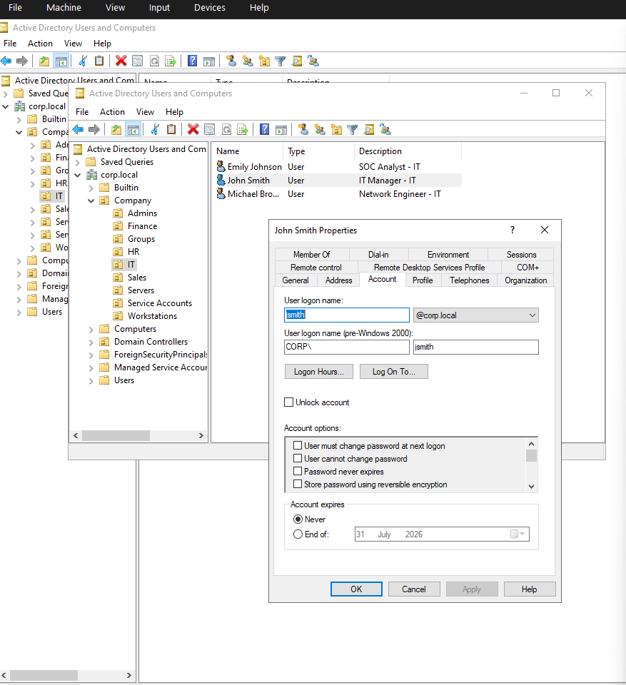
</p>

---

## PowerShell Automation

PowerShell automation was used to rapidly provision users, groups, and service accounts, reducing manual configuration and reflecting how administrators manage large enterprise environments.

<p align="center">
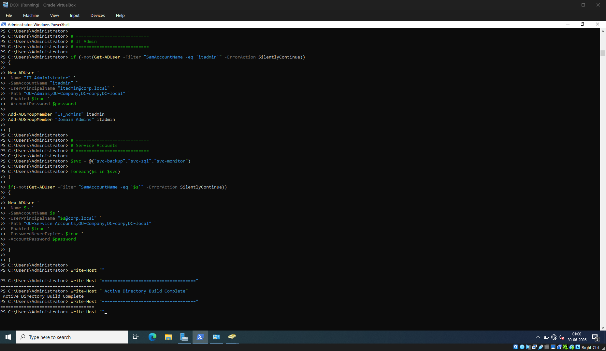
</p>

---

## Service Account Configuration

A dedicated SQL service account was created and assigned a Service Principal Name (SPN). This intentionally vulnerable configuration was used later to demonstrate and detect Kerberoasting attacks.

<p align="center">
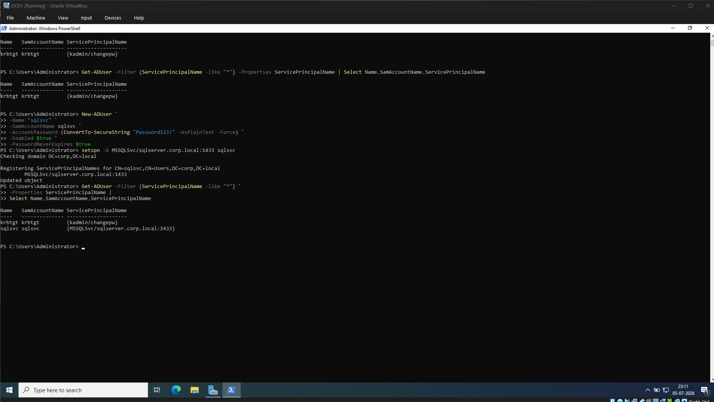
</p>

---

## AS-REP Roastable Account Configuration

A separate user account was configured with Kerberos pre-authentication disabled. This allowed the environment to simulate AS-REP Roasting attacks and validate corresponding detections within Wazuh.

<p align="center">
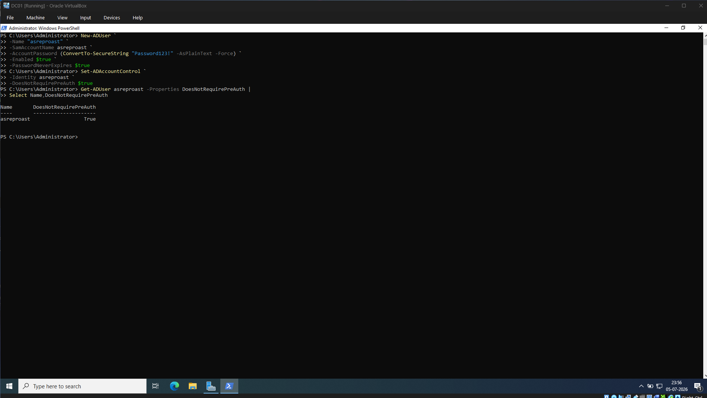
</p>

---

# ✅ Active Directory Deployment Summary

At the end of this phase, the lab contained:

| Component | Status |
|-----------|--------|
| Active Directory Domain Services | ✅ Deployed |
| Domain Controller | ✅ Configured |
| Windows 10 Domain Join | ✅ Completed |
| Organizational Units | ✅ Created |
| Enterprise Users | ✅ Created |
| Security Groups | ✅ Configured |
| Service Accounts | ✅ Configured |
| PowerShell Automation | ✅ Implemented |

This provided a realistic enterprise environment that served as the foundation for attack simulation, security monitoring, and threat hunting during the later stages of the project.

---

# 🛡️ Wazuh Integration

To provide centralized visibility into Windows activity, the Domain Controller was integrated with Wazuh. The Wazuh agent was configured to collect Windows Security, System, Application, and Sysmon logs, enabling detailed monitoring of authentication events, process creation, account management, and Active Directory activity.

This integration transformed the lab from a traditional Active Directory deployment into a Security Operations Center (SOC) environment capable of detecting and investigating malicious behavior.

---

## Wazuh Agent Configuration

The Wazuh agent was configured on the Domain Controller to monitor multiple Windows log sources, providing comprehensive telemetry for threat detection and investigation.

<p align="center">
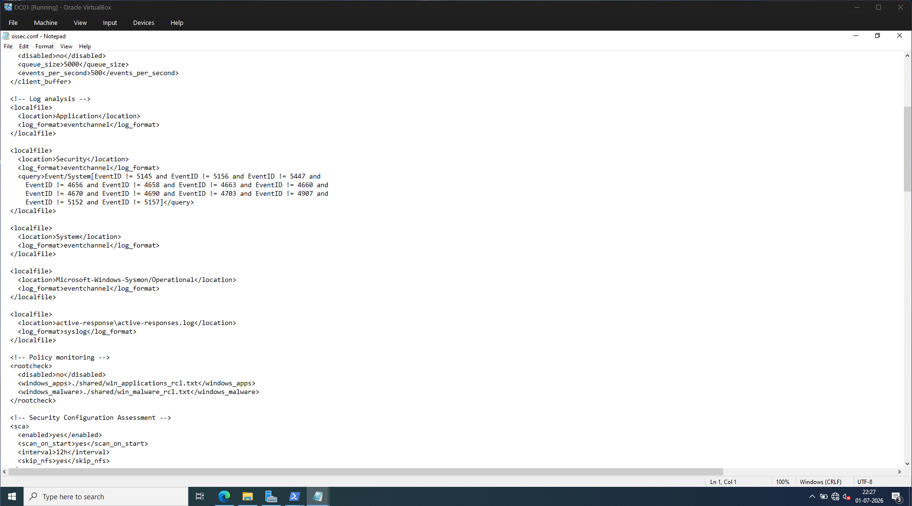
</p>

---

# ⚔️ Active Directory Attack Simulation

After completing the Active Directory deployment, multiple attack techniques were executed from a Kali Linux machine to validate detection capabilities and generate realistic security events.

These attacks were performed in an isolated lab environment for educational and defensive purposes.

---

## Simulated Attack Techniques

| Attack Technique | Purpose |
|------------------|---------|
| SMB User Enumeration | Enumerate domain users through SMB authentication |
| SMB Share Enumeration | Discover accessible network shares |
| Kerberoasting | Request Kerberos service tickets for offline password cracking |
| AS-REP Roasting | Extract AS-REP hashes from vulnerable user accounts |
| Account Enumeration | Identify users and service accounts within the domain |

---

## SMB User Enumeration

NetExec was used to authenticate against the Domain Controller and enumerate Active Directory user accounts.

<p align="center">
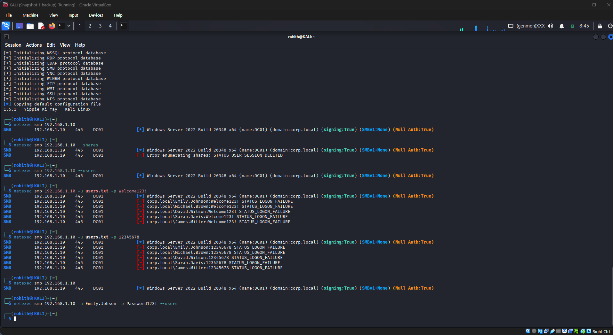
</p>

---

## SMB Share Enumeration

Accessible SMB shares, including administrative and domain shares such as `NETLOGON` and `SYSVOL`, were successfully enumerated.

<p align="center">
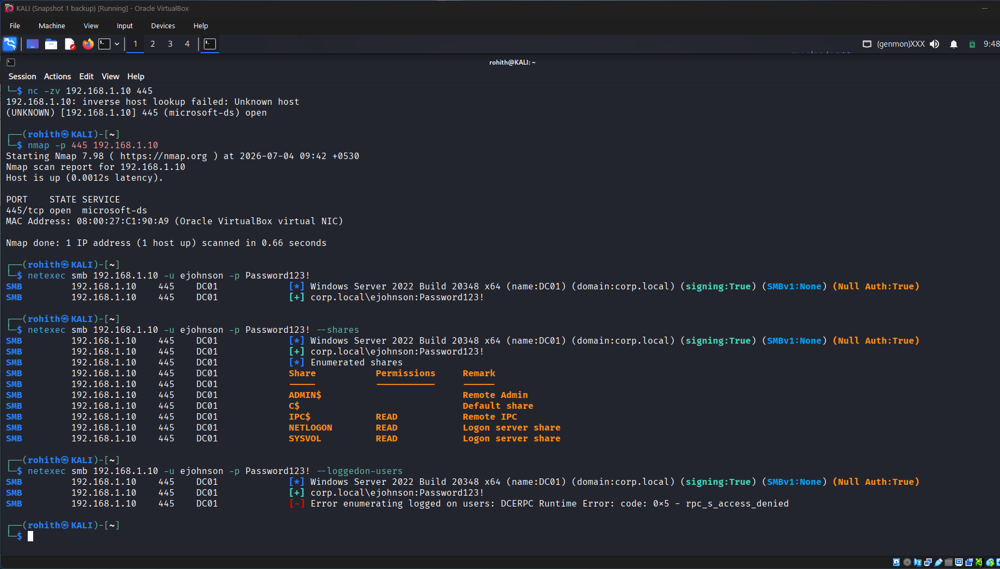
</p>

---

## Kerberoasting Attack

A service ticket was requested for the configured SQL service account using Impacket's `GetUserSPNs`. This simulated the Kerberoasting technique commonly used by attackers to obtain Kerberos service tickets for offline password cracking.

<p align="center">
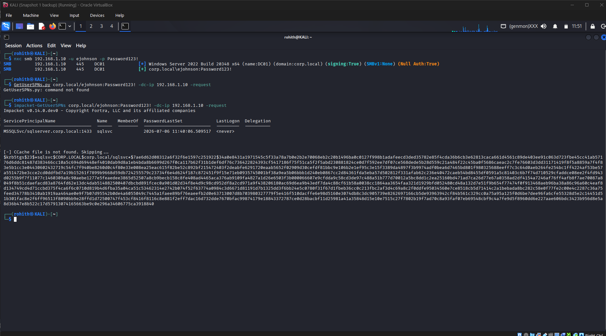
</p>

---

## AS-REP Roasting Attack

A user account configured without Kerberos pre-authentication was targeted using Impacket's `GetNPUsers`, demonstrating the AS-REP Roasting technique and generating authentication events for later analysis.

<p align="center">
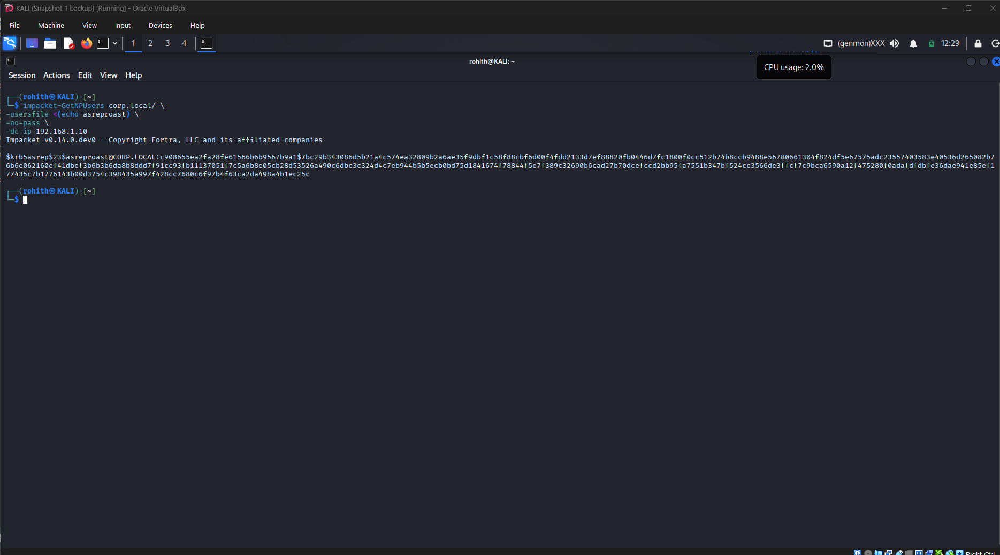
</p>

---

# 🎯 Attack Validation Summary

The attack simulations successfully generated realistic security events that were collected by Wazuh and later analyzed through dashboards, threat hunting, and MITRE ATT&CK mapping.

| Technique | Result |
|-----------|--------|
| SMB User Enumeration | ✅ Successful |
| SMB Share Enumeration | ✅ Successful |
| Kerberoasting | ✅ Successful |
| AS-REP Roasting | ✅ Successful |
| Windows Authentication Events | ✅ Collected |
| Wazuh Detection | ✅ Verified |

---

# 📊 Detection & Monitoring

Following the attack simulations, Wazuh collected and correlated Windows Security and Sysmon events generated by the Domain Controller. The platform provided centralized visibility into authentication activity, account management, process execution, and Active Directory events.

Using Wazuh dashboards and event analysis, it was possible to validate that the simulated attacks generated meaningful telemetry and map the observed behaviors to the MITRE ATT&CK framework.

---

# 🧠 MITRE ATT&CK Dashboard

The MITRE ATT&CK dashboard provides an overview of the adversary techniques observed within the environment. Wazuh automatically mapped relevant events to ATT&CK techniques, helping identify attacker behavior rather than isolated log entries.

<p align="center">
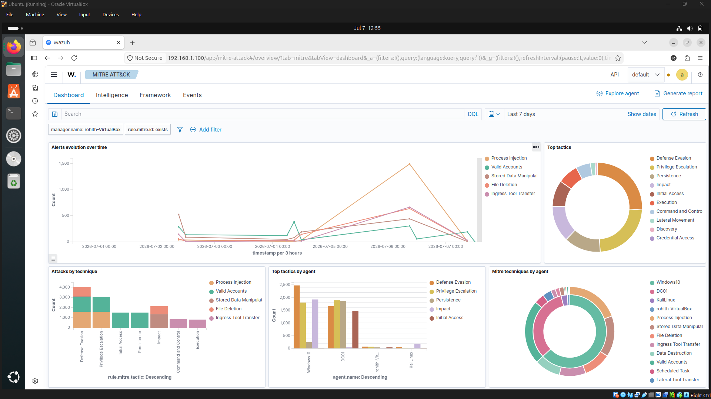
</p>

Key observations:

- Centralized visibility into detected techniques
- MITRE ATT&CK mapping for security events
- Technique distribution across the monitored environment
- Improved analyst context during investigations

---

# 🔍 Threat Hunting Dashboard

The Threat Hunting dashboard provides analysts with a high-level view of endpoint activity, authentication events, alerts, and monitored systems.

This dashboard serves as the starting point for investigating suspicious behavior before pivoting into detailed event analysis.

<p align="center">
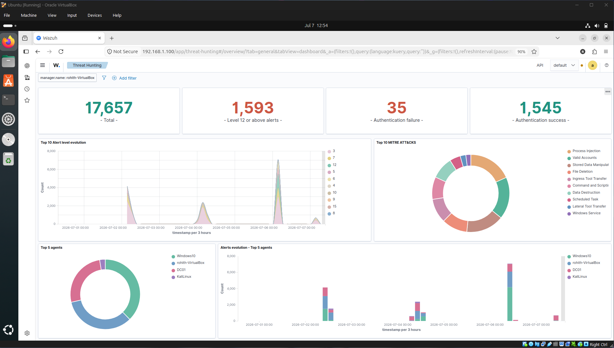
</p>

Key observations:

- Authentication activity
- Endpoint visibility
- Alert trends
- Event distribution
- Monitored hosts

---

# 🚨 MITRE ATT&CK Event Investigation

Individual security events generated during the attack simulations were reviewed through the MITRE ATT&CK event view.

This allowed each detection to be correlated with the associated ATT&CK technique, making it easier to understand attacker behavior and validate detection coverage.

<p align="center">

</p>

Examples of observed activity included:

- Account discovery
- PowerShell execution
- Windows authentication events
- Active Directory enumeration
- Kerberos-related activity

---

# 🕵️ Threat Hunting Investigation

Detailed event analysis was performed using Wazuh's Threat Hunting interface, allowing security events to be filtered, reviewed, and correlated over time.

<p align="center">

</p>

The investigation process focused on:

- Authentication events
- User activity
- Process execution
- Security alerts
- Windows event correlation

---

# 🔐 Authentication Monitoring

Authentication-related events generated throughout the attack simulations were reviewed to validate successful log collection and identify suspicious authentication patterns.

<p align="center">

</p>

Observed authentication activity included:

- Successful logons
- Failed logons
- NTLM authentication
- Anonymous logons
- Windows security events

---

# 🧩 MITRE ATT&CK Techniques Observed

| MITRE Technique | ID |
|-----------------|----|
| Account Discovery | T1087 |
| Group Discovery | T1069 |
| PowerShell | T1059.001 |
| Remote System Discovery | T1018 |
| Valid Accounts | T1078 |
| Kerberoasting | T1558.003 |
| AS-REP Roasting | T1558.004 |
| Network Share Discovery | T1135 |

---

# 📈 Detection Highlights

Throughout the project, Wazuh successfully collected telemetry generated during each phase of the attack lifecycle.

Detection capabilities demonstrated in this lab included:

- Windows Security Event monitoring
- Sysmon event collection
- Active Directory account monitoring
- Authentication monitoring
- MITRE ATT&CK mapping
- Threat hunting workflows
- Endpoint telemetry collection
- Security event correlation
- Centralized log analysis

These detections confirmed that the simulated attack activity was successfully captured and made available for investigation through a centralized SOC workflow.

---

# 💡 Skills Demonstrated

This project provided hands-on experience across multiple Blue Team and Active Directory administration tasks commonly performed by SOC analysts and security administrators.

### Active Directory

- Active Directory Domain Services (AD DS)
- Domain Controller Deployment
- Organizational Unit (OU) Management
- User Administration
- Security Group Management
- Service Account Configuration
- Windows Domain Administration
- PowerShell Automation

### Security Operations

- Wazuh SIEM Administration
- Sysmon Configuration
- Windows Event Log Collection
- Threat Hunting
- Alert Investigation
- Security Event Correlation
- Endpoint Monitoring
- Log Analysis

### Attack Simulation

- SMB Enumeration
- User Enumeration
- Share Enumeration
- Kerberoasting
- AS-REP Roasting
- Active Directory Reconnaissance
- Authentication Analysis

### Security Frameworks

- MITRE ATT&CK
- Windows Security Logging
- Security Monitoring
- Detection Engineering Fundamentals

---

# 📚 Key Takeaways

Building this lab provided practical experience beyond simply deploying Active Directory.

Some of the most valuable lessons included:

- Understanding how enterprise identity infrastructure is built and managed.
- Learning how attackers enumerate and abuse Active Directory environments.
- Configuring centralized log collection using Wazuh and Sysmon.
- Mapping attack techniques to the MITRE ATT&CK framework.
- Investigating authentication events and security telemetry from a defender's perspective.
- Gaining experience with both Windows administration and Security Operations workflows.

This project strengthened my understanding of how Active Directory administration, endpoint monitoring, and threat detection work together in a modern SOC environment.

---

# 🚀 Future Improvements

Possible future enhancements for this lab include:

- Deploy additional Windows client systems
- Configure Group Policy Objects (GPOs)
- Simulate lateral movement scenarios
- Integrate Microsoft Sentinel for multi-SIEM monitoring
- Perform BloodHound Active Directory analysis
- Simulate ransomware behavior for detection testing
- Expand PowerShell automation for user provisioning
- Add Sigma rules for custom detections
- Develop Wazuh detection rules for additional Active Directory attack techniques

---

# 📂 Project Summary

| Category | Details |
|----------|----------|
| Environment | Windows Server 2022, Windows 10, Ubuntu Server, Kali Linux |
| Identity Platform | Active Directory Domain Services |
| SIEM | Wazuh |
| Endpoint Monitoring | Sysmon |
| Automation | PowerShell |
| Attack Tools | NetExec, Impacket |
| Detection Framework | MITRE ATT&CK |
| Virtualization | VirtualBox |

---

# 🎯 Skills Highlighted for SOC Roles

- Active Directory Administration
- Windows Server Administration
- Security Monitoring
- Threat Hunting
- SIEM Operations
- Endpoint Visibility
- Windows Event Analysis
- MITRE ATT&CK Mapping
- Authentication Analysis
- Log Correlation
- Incident Investigation
- Blue Team Fundamentals

---

## 🤝 Connect With Me

If you'd like to discuss this project or connect professionally, feel free to reach out.

- **LinkedIn:** *(Add your LinkedIn profile here)*
- **TryHackMe:** *(Add your TryHackMe profile here)*

---

## ⭐ If you found this project helpful

If you found this repository useful or interesting, consider giving it a ⭐.

Feedback and suggestions are always welcome.
